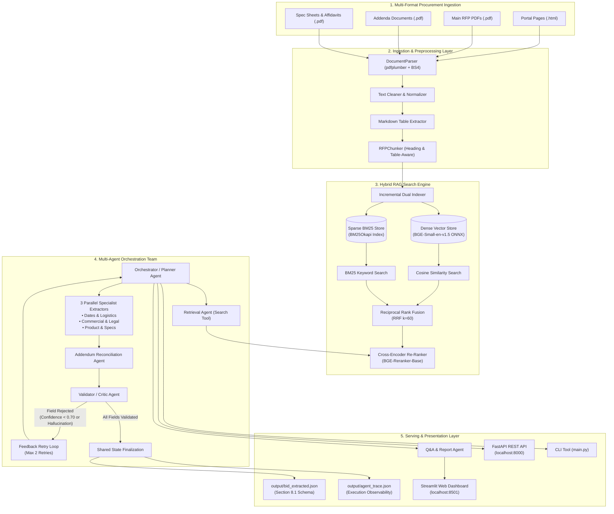
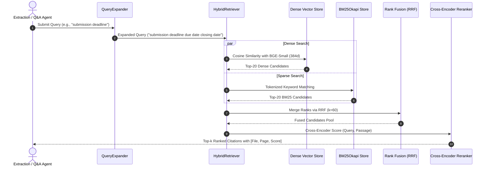
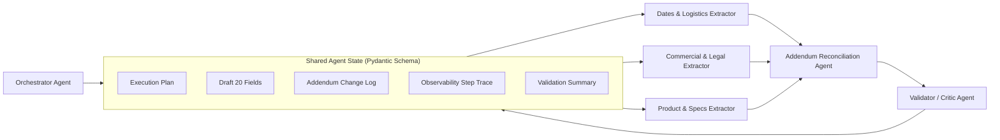

# System Architecture Blueprint

## 1. High-Level Architecture Diagram

---

## 2. Component Design & Technical Specifications

### A. Document Parsing & Ingestion (`ingestion/`)
- **DocumentParser**:
  - Automatically identifies document classes: `rfp`, `addendum`, `specs`, `affidavit`, and `bid_page`.
  - Extracts tables using `pdfplumber` and serializes them into standard Markdown tables (`| Col 1 | Col 2 |`), ensuring column semantics remain intact.
  - Cleans OCR glitches, removes repeated running headers/footers, and repairs broken hyphenations (`solici-\ntation` $\rightarrow$ `solicitation`).
  - Tags every page with `bid_id`, `file_name`, `page_number`, `doc_type`, and `document_date`.
- **RFPChunker**:
  - Detects section headings (e.g., `Section 1 - General Information`, `ARTICLE IV`) and carries them as breadcrumbs `[Section Title]` for all child chunks.
  - Keeps table blocks contiguous; splits oversized tables row-by-row while preserving header rows.
  - Applies a 600-character window with a 120-character sliding overlap.

---

### B. Dual-Store Hybrid Search Engine (`search/`)

- **Dense Store (`embeddings.py`)**:
  - Uses `BAAI/bge-small-en-v1.5` executed locally via ONNX Runtime.
  - Embeddings are L2-normalized on generation, converting cosine similarity into a dot product.
- **Sparse Store (`indexer.py`)**:
  - Implements `BM25Okapi` with lowercase alphanumeric tokenization and punctuation stripping.
  - Critical for identifying SKU codes, solicitation numbers, and dollar amounts.
- **Reciprocal Rank Fusion (`hybrid_retriever.py`)**:
  $$RRF(d) = \sum_{m \in \{dense, sparse\}} \frac{1}{k + \text{rank}_m(d)}$$
  Using standard constant $k=60$.
- **Cross-Encoder Re-Ranking (`reranker.py`)**:
  - Uses `BAAI/bge-reranker-base` to evaluate $(query, passage)$ pairs simultaneously using cross-attention.

---

## 3. Multi-Agent Orchestration Architecture (`agents/`)

### Agent Roles:
1. **Orchestrator Agent (`orchestrator.py`)**: Formulates the 6-step execution plan, dispatches specialist extractors, manages shared memory, and coordinates retries.
2. **Ingestion Agent (`ingestion_agent.py`)**: Manages the file discovery, parsing, chunking, and incremental indexing lifecycle.
3. **Retrieval Agent (`retrieval_agent.py`)**: Acts as a search tool for other agents, applying metadata filters and returning cited passages.
4. **Specialized Extraction Agents (`extraction_agents.py`)**:
   - `DatesLogisticsExtractor`: Due Date, Delivery Date, Submission Type, Pre-Bid Meeting, Term, Contact Info, Company Name.
   - `CommercialLegalExtractor`: Bid Number, Title, Bid Bond, Payment Terms, Additional Docs, MFG Registration, Cooperative.
   - `ProductSpecsExtractor`: Model_no, Part_no, Product, Specifications, Installation, Bid Summary.
5. **Addendum Reconciliation Agent (`addendum_agent.py`)**: Compares original solicitation terms against chronological addenda, overriding expired dates and specifications while documenting changes.
6. **Validator / Critic Agent (`validator_agent.py`)**: Enforces strict grounding (values must be explicitly backed by citation text), verifies date and currency formats, and detects hallucinations.
7. **Q&A & Report Agent (`qa_agent.py`)**: Synthesizes cited natural language answers and cross-bid comparative summaries.

---

## 4. Observability & Tracing Architecture

Every agent step is captured in `SharedAgentState.trace` and exported to `output/agent_trace.json`:
- `step_id`: Monotonically increasing execution step identifier.
- `timestamp`: ISO-8601 UTC timestamp.
- `agent_name`: Name of the active agent.
- `action`: Specific method executed (e.g. `formulate_plan`, `extract_fields`, `reconcile`).
- `input_data`: Input payload received by the agent.
- `tool_calls`: Tool invocations executed during the step.
- `output_data`: Produced field values, changes, or validation results.
- `latency_ms`: Step execution duration in milliseconds.
- `status`: `success` or `failed`.
